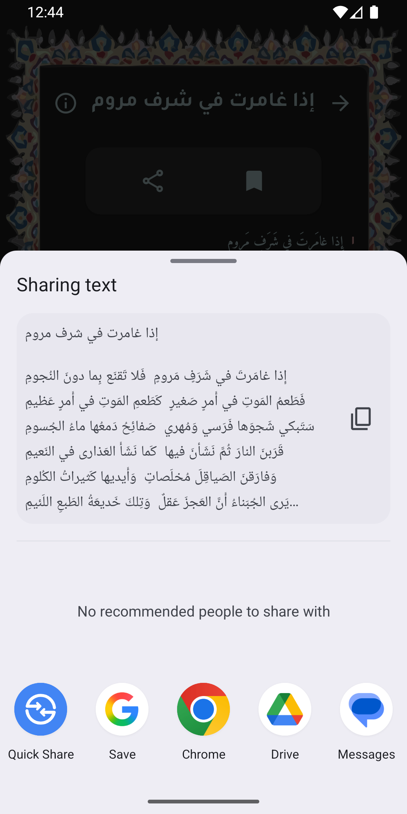

# 📖 Diwan App – Classical Arabic Poems

A Flutter poetry application that allows users to read **classical Arabic poems** with synchronized audio recitation and real-time verse highlighting.

The app is fully offline and designed to provide a smooth and immersive Arabic reading experience.

It features poems from legendary poets like Al-Mutanabbi and Ahmed Shawqi, among others.

---

## ✨ Features

- 🚀 **Splash Screen**
- 🏠 **Home:** Browse poems and search by poem name or poet.
- 🔎 **Debounced Search:** 500ms debounce for optimized performance.
- 📖 **Poem Details:**
  - Verse-by-verse reading
  - Real-time verse highlighting
  - 🔠 Adjustable font size (increase / decrease for better readability)
- 🎧 **Offline Audio Playback:** Using `just_audio`.
- 📤 **Share Poem Text:** Share full poem text directly from the app.
- ⭐ **Favorites:** Stored locally using `SharedPreferences`.
- 🌙 **Theme Switching:** Full light & dark mode support.
- 🧭 **Hidden Drawer Menu**
- ℹ️ **About Us Page**
- 🌐 **Arabic Localization & RTL Support**
- 📦 **Fully Offline Architecture (Local JSON-based backend)**

---

## 🧠 Smart Audio Architecture

Each poem in the local JSON file includes:

- Path to its MP3 file
- Path to its timestamp JSON file

Each timestamp file contains:

- Verse number
- Start time
- End time

When adding a new poem:

1. Add the MP3 file
2. Add its timestamp JSON file
3. Update the main poems JSON file

✅ No code modification required — the app automatically handles new poems.

This makes the app scalable and developer-friendly.

---

## 🚀 Tech Stack

| Category | Tools / Packages |
|----------|------------------|
| Framework | Flutter |
| Architecture | MVVM |
| State Management | ChangeNotifier (Controller-based) |
| Audio Engine | just_audio |
| Local Storage | SharedPreferences |
| Data Source | Local JSON |
| Localization | flutter_localizations |
| UI Utilities | flutter_screenutil |
| Animations | Flutter animations |

---

## 🏗️ Folder Structure
```
lib/
├── core/
│ ├── models/
│ ├── utils/
│ ├── constants/
│ └── ...
├── features/
│ ├── splash/
│ ├── home/ (includes poem details screen)
│ ├── favorites/
│ ├── about_us/
│ └── ...
├── data/
│ ├── poems.json
│ ├── timestamps/
│ └── audio/
```

---

## 📱 Screenshots

<p align="center">
  
  
</p>
  
<p align="center">
  
  
</p>
  
<p align="center">
  
  
</p>

<p align="center">
  
  
  
</p>

<p align="center">
  
  
</p>

---

## 🧩 Architecture Overview (MVVM)

The app follows the **Model-View-ViewModel (MVVM)** pattern:

- **Model:** Poem data and verse timestamps
- **View:** Flutter UI screens
- **ViewModel (Controllers):** Business logic using `ChangeNotifier`
- **Data Layer:** Local JSON files + SharedPreferences

### Controllers in Poem Details

- 📘 **Reader Controller**
  - Handles audio playback
  - Listens to audio position
  - Controls verse highlighting

- 🔠 **Font Size Controller**
  - Manages dynamic font scaling
  - Allows users to increase/decrease text size
  - Notifies UI independently from audio logic

This separation ensures clean responsibility management and better scalability.

---

## 🎯 Performance & UX Optimizations

- 🔄 500ms debounced search to reduce unnecessary rebuilds.
- ⚡ Smooth animations across navigation and theme switching.
- 🎧 Efficient audio position listener for precise verse highlighting.
- 📂 Fully offline structure for fast loading and reliability.
- 🧠 Separation of controllers for clean architecture design.

---

## 👨‍💻 My Contribution

- Full app design & architecture.
- Complete Flutter UI implementation.
- Audio synchronization engine.
- Local JSON backend design.
- Favorites persistence system.
- Search optimization using debouncing.
- Smooth RTL experience and theme switching.
